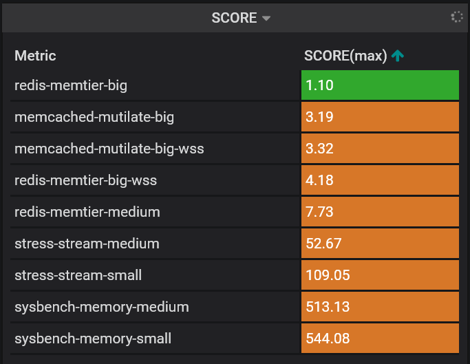

************************
Score algorithm overview
************************

We constructed a heuristic for automatic assessment of how well a workload match a node with
Intel PMEM memory installed ran in 2LM mode. The heuristic is trying to reach two goals:
1) use as much of memory as possible on PMEM nodes 2) minimize a chance of worsening workloads performance
(comparing to DRAM). The 2) is approached with idea that performance can be degraded mostly when any of: memory bandwidth,
L4 cache (in 2LM mode DRAM runs as a next level cache) shared resources are saturated.

*The heuristic assigns to each workload a single positive rational number*, thus creating a sorted list, if
taking into consideration all workloads. That single number, we call a workloads **score**.
**Lower** the number, **better** a workload fits the PMEM node according to our heuristic.
The value of score does not depends on different workloads, but only on workload innate features.

But what the algorithm considers a **workload**? As a workload the solution treats a Kubernetes
**statefulset** or a **deployment**. All pods of a statefulset/deployment are treated as instances
of the same workload.

The algorithm is implemented as a set of **Prometheus rules**. Thanks to that can be easily visualized,
simply understood and tweaked by a cluster operator.

Score value interpretation
##########################

Nice feature of the algorithms is that the score value has intuitive interpretation, which is explained below.

Having a workload with score of value *S=score(workload)*, by scheduling only instances of that workload to PMEM node we
should according to the heuristic maximally use **1/S * 100%** capacity of memory of that node (the heuristic on purpose
ignores the fact that we cannot schedule `part` of the workload as the main focus is really the proportions between
resources requirements, not the absolute values).
By sticking to that limit *(1/S * 100%)* the node shared resources such as: CPU, memory, memory
bandwidth and L4 cache, should not be saturated.

For example, if *S=score(workload_A)=2* is assigned to a workload *A*, it means that by scheduling
only that workload to a PMEM node, we can maximally use *50%* (0.5*100%) of memory of that node
not experiencing expected by heuristic shared resource saturation.

.. csv-table::

    "Score", "PMEM Memory max usage"
    "1", "100%"
    "1.5", "75%"
    "2", "50%"
    "3", "33%"
    "10", "10%"

As we see score of value *10* indicates that the workload does not fit PMEM node at all – scheduling it into PMEM
is a waste of space which could be used by another workload with better score.

If a workload has score lower than 1, by putting it into equation, we get memory usage which is bigger than 100%.
It can be interpreted that we should increase the PMEM node memory space to experience resources saturation.

Scores for our testing workloads
################################

Below we provide a screenshot of Graphana dashboard provided by us for visualization of final and
transitional results of the algorithm. For our testing workloads the score values are widely scattered.
As a far best workload with *score=1.1* is considered *redis-memtier-big*.

Workloads characterization
##########################

For each workload the heuristic approximates (among others):

- peak **memory bandwidth** used (traffic from caches to RAM memory) with division on read/write,
- peak **working set size** (number of touched memory pages in a period of time).

All this is calculated based on historical data (as default history window is set to 7 days).
Please refer to `prometheus_rule.score.yaml <../examples/kubernetes/monitoring/prometheus/prometheus_rule.score.yaml>`_.

Setting cut-off Score value
###########################

The created workloads scores list can be used to manually place workloads
to make the best use of nodes with PMEM memory modules installed.

We recommend to schedule only workloads with score of value  **S <= S_cutoff** where **S_cutoff=1.5** on PMEM nodes.
If workloads are scheduled manually, make sure only **1/S_cutoff * 100%** of total available
memory is used by workloads.

Our additional tool `WCA-Scheduler <wca-scheduler.rst>`_ can perform that task automatically
taking into consideration more factors.

**************
Configuration
**************

Gathering required metrics
##########################

The score is calculated based on the metrics provided by `WCA` or `cAdvisor`.

WCA
***
For calculating Score some metrics provided by WCA agent are needed.
Please use below defined configuration file for WCA agent as a template.

.. code-block:: yaml

  runner: !MeasurementRunner
  interval: 5.0
  node: !KubernetesNode
    cgroup_driver: cgroupfs
    monitored_namespaces: ["default"]
    kubeapi_host: !Env KUBERNETES_SERVICE_HOST
    kubeapi_port: !Env KUBERNETES_SERVICE_PORT
    node_ip: !Env HOST_IP

  metrics_storage: !LogStorage
    overwrite: True
    output_filename: /var/lib/wca/metrics.prom

  extra_labels:
    node: !Env HOSTNAME
  event_names:
    - task_cycles
    - task_instructions
    - task_offcore_requests_demand_data_rd
    - task_offcore_requests_demand_rfo
  enable_derived_metrics: True
  uncore_event_names:
    - platform_cas_count_reads
    - platform_cas_count_writes
    - platform_pmm_bandwidth_reads
    - platform_pmm_bandwidth_writes

  wss_reset_interval: 1
  gather_hw_mm_topology: True

``node`` and ``metrics_storage`` should not be changed. Node is responsible for communication with the Kubernetes API,
and metric storage for displaying metrics in the Prometheus format.

Field changes may be required for ``cgroup_driver`` on another using driver by Docker,
and ``monitored_namespaces`` form ‘default’ when workloads running in another Kubernetes namespace.

It is necessary to set in its configuration file:

- ``gather_hw_mm_topology set`` as *True*;
- ``enable_derived_metrics set`` as *True*;
- In ``event_names`` enable
    - **task_offcore_requests_demand_data_rd**
    - **task_offcore_requests_demand_rfo**

cAdvisor
********

Future work. It’s not yet fully supported.

Prometheus rules
################

The score algorithm is implemented as `a set of Prometheus rules <../examples/kubernetes/monitoring/prometheus/prometheus_rule.score.yaml>`_.

Configuring the Prometheus
**************************

Prometheus is required for the score implementation to work. We provide an example way of
deploying Prometheus in our repository.

No deployed Prometheus on the cluster
*************************************

We use configuration prepared in the repository under the path `examples/kubernetes/monitoring` by using
`kustomize` (https://kubernetes.io/docs/tasks/manage-kubernetes-objects/kustomization/).
It deploys all monitoring required for calculating the Score.

Existing Prometheus on the cluster
**********************************

In case Prometheus is already deployed it is only required to deploy rules defined in
the files:
- `prometheus_rule.score.yaml <../examples/kubernetes/monitoring/prometheus/prometheus_rule.score.yaml>`_
(or generated by script described in next paragraph if one wants to change default history window length);
- `prometheus_rule.pmem.yaml <../examples/kubernetes/monitoring/prometheus/prometheus_rule.pmem.yaml>`_ if there is no
PMEM node on the cluster (this rules add virtual PMEM node metrics).

This could be accomplished using command:

.. code-block:: shell

    kubectl apply -n prometheus -f examples/kubernetes/monitoring/prometheus/prometheus_rule.score.yaml \
                                   examples/kubernetes/monitoring/prometheus/prometheus_rule.pmem.yaml

Configuring the Score
#####################

As mentioned in `Workloads characterization`_ the approximators of workloads features are calculated
as peak value using **max** and **quantile_over_time** prometheus functions:

.. code-block:: yaml

    - record: app_mbw_flat
      expr: 'max(quantile_over_time(0.95, task_mbw_flat[7d:2m])) by (app)'
    - record: app_wss
      expr: 'max(quantile_over_time(0.95, task_wss_referenced_bytes[7d:2m])) by (app) / 1e9'

By default the period length is set to 7 days, but can be changed using
`generator_prometheus_rules.py script <../examples/kubernetes/scripts/generator_prometheus_rules.py>`_ or manually.

.. code-block:: shell

    python3 examples/kubernetes/scripts/generator_prometheus_rules.py --features_history_period 7d –output prometheus_rules_score.yaml

`features_history_period` is time used in rules. Prometheus query language supports time
durations specified as a number, followed immediately by one of the following
units: s - seconds, m - minutes, h - hours, d - days, w - weeks, y - years.

Grafana dashboard
*****************

We prepared graphana dashboard `graphana dashboard <../examples/kubernetes/monitoring/prometheus/graphana_score.yaml>`_
for visualization of the results mentioned in `Scores for our testing workloads`_.

Limitations
###########

There are few limitations of our solution, which depending on usage can constitute a problem:

- no support for statefulset/deployment versions,
- due to used mentioned in `Configuring the Score` prometheus functions, requirements of some
workload can be overestimated, e.g. if workload is wrongly configured and keeps restarting after a short period of time
- as we take CPU/MEM requiremnts from Kubernetes defined limits, if workload does not have that data defined
will be ignored.